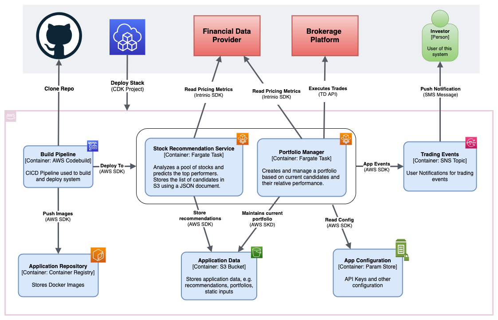
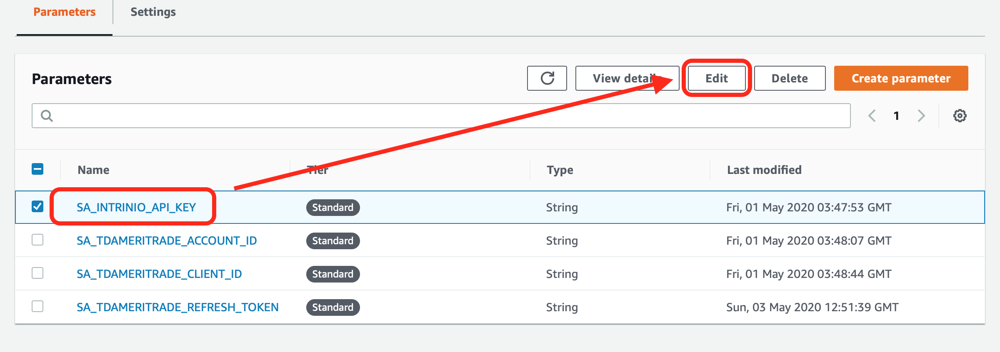
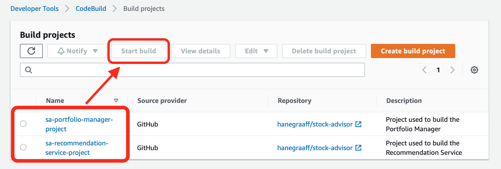

# Stock Advisor Infrastructure
This project contains the scripts necessary to deploy the Stock Advisor system. The scripts are based on the AWS CDK and are invoked using the standard entrypoints.

The system is organized into two different GitHut projects

|Project Name|Project URL|Description|
|---|---|---|
|Stock Advisor Infrastructure|https://github.com/hanegraaff/stock-advisor-infrastructure|Contains automation to deploy infrastructure and CI automation|
|Stock Advisor Software|https://github.com/hanegraaff/stock-advisor-software|Stock Advisor Services. The software that makes up the system|

# Project status
The project is under development.

 # Overview


Stock Advisor is an algorithmic trading system that can trade on your behalf using your brokerage account. It tracks an evolving portfolio of US securities based on market sentiment and actively trades it.

The system is written in Python and runs in AWS, using a serverless platform. It relies on an external source for its financial data as well as an existing online brokerage platform to execute trades. Financial data is provided by **Intrinio** (www.intrinio.com), while brokerage services are provided using the **TDAmeritrade** api (https://www.tdameritrade.com/api.page).

Broadly speaking, the system is organzined in two services. †he first is a recommendation service that predicts a monthly pool of US Equities expected to outperform the market, and the second is a portfolio manager maintans a portfolio based on it.

## Recommendation Service
**Status: Initial Development Complete**

This service makes monthly recommendations of US equities using a market sentiment based algorithm based on market sentiment and stores the results in S3. It runs inside a docker container as a Fargate task in the EC2 cluster, and is scheduled to run at the beginning of each month once all analyst target price predictions have been made available. 

The input is a list of ticker symbols that represents the universe of stocks that will be analyzed. This list can contain any US Stocks and currently uses the DOW30. Eventually it will be replaced with the S&P500, or other larger indexes. 

The service requires access to financial data, specifically pricing information and analyst forecasts, which is downloaded and cached in order to reduce reliance in the Data APIs

## Portfolio Manager
**Status: Under Development**

The portfolio manager selects a portfilio based on the current recommendationd, and is responsible for managing the underlining trades to get there. As inputs, the portfolio manager comapres the current portfolio wil the latest recommendations and decides whether to rebalance its positions or not.

Like the Recommendation service, the portfolio manager runs as a Fargate task and is scheduled to run daily, at 11 AM EST.

# Stock Advisor AWS Infrastructure
**Status: Initial Development Complete**

Stock Advisor's infrastructure is defined using a CDK based script, which exposes three stacks:

```
>>cdk ls
app-infra-base
app-infra-compute
app-infra-develop
```

Information on getting started with the CDK is available here:

https://docs.aws.amazon.com/cdk/latest/guide/getting_started.html

## Application namespace

It is possible to create multiple instances of the Stock advisor infrastructure by using a namespace that is used to prefix the resources and exports created by this automation.

The namespace is defined inside ```app.py``` and is currently set to ```sa```

```
props = {
  'APPLICATION_PREFIX': 'sa'
}
```

To create a second application stack you must change the application namespace value in the script, and run it again.

## app-infra-base stack


This stack creates the foundational resources which don't change often, and include:

1) A Public VPC spanning two subnets (no NAT)
2) S3 buckets to store application data and artifacts
3) ECS cluster compatible with Fargate.
5) SNS Topic used for application notifications
6) Application parameters stored in Parameter Store
7) A security group used by the ECS tasks.
8) IAM task role that define the AWS permissions allowed by the ECS tasks.

### Exports
|Export Name|Description|
|---|---|
|{app_ns}-data-bucket-name|S3 Data Bucket used by the application|
|{app_ns}-app-notifications-topic|SNS Topic for application notifications|

Additionally, there are automatically generated exports which are not documented here. These are used by the CDK to create dependencies between stacks


## app-infra-compute stack

This stack creates the application compute resources that are more prone to change and include:

1) ECR repository for the Recommendation Service Image
2) ECR repository for the Portfolio Manager
2) ECS Task and Schduled Task definitions
3) ECS Execution IAM role. The role is maintained here since each new task definition will inject an additional policy into it.
    
## app-infra-develop stack


Contains the application CICD's resources, namely the CodeBuild project used to build the two services listed above


# Deploying the System

## Prerequisites
1) Latest AWS CDK
2) Latest Python 3.x
3) An AWS account where resources can be deployed
4) AWS Credentials stored in a way compatible with Boto

## Create a virtual environment
```
$ python3 -m venv .env
```

After the init process completes and the virtualenv is created, you can use the following
step to activate your virtualenv.

```
$ source .env/bin/activate
```

If you are a Windows platform, you would activate the virtualenv like this:

```
% .env\Scripts\activate.bat
```

## Installing Dependencies
Once the virtualenv is activated, you can install the required dependencies.

```
$ pip install -r requirements.txt
```

To add additional dependencies, for example other CDK libraries, just add to
your requirements.txt file and rerun the `pip install -r requirements.txt`
command. Alternatively you may add those to ```setup.py```


## Creating/Destrying the application infrastructure

To create or update the application infrastructure you may rely on the ```cdk deploy``` command

```
cdk deploy app-infra-base
cdk deploy app-infra-compute
cdk deploy app-infra-develop
```

To destroy it, use the ```cd destroy``` command

```
cdk destroy app-infra-base
cdk destroy app-infra-compute
cdk destroy app-infra-develop
```

To create the application infrastructure in a sigle command use:

```
cdk deploy app-infra-base app-infra-compute app-infra-develop
```

The infrastructure can be destroyed using a similar command line

```
cdk destroy app-infra-base app-infra-compute app-infra-develop
```

## Testing
CDK doesn't currently offer testing framework for Python, but a basic testing script can be executing using```pytest```.

Unit tests will be added a soon as CDK offers it.


## Useful commands

 * `cdk ls`          list all stacks in the app
 * `cdk synth`       emits the synthesized CloudFormation template
 * `cdk deploy`      deploy this stack to your default AWS account/region
 * `cdk diff`        compare deployed stack with current state
 * `cdk docs`        open CDK documentation


# Building and deploying the application software
Once you have successfully deployed the infrastructure, you may now build and deploy the application software, namely the docker images that represent the services described above.

## Setting the Intrinio API key
First navgate to the parameter store and find the stack's and find the appropriate ```INTRINIO_API_KEY```, prefixed with the value of ```APPLICATION_PREFIX```



Next replace the default value ```put_api_key_here``` with a valid key. You may sign up for a sandbox or production key by visiting the Intrinio website

## Setting up Notifications

Once the infrastructure is deployed, application events are published to a SNS topic wich is created by the app-infra-base stack. You may set up an email or SMS Notification manually using the AWS console.

## Running the CodeBuild jobs

The ```app-infra-develop``` stack exposes 2 CodeBuild project that can be used to build the Stock Advisor services



To build the services, simply start the build process, no customizations are needed. Note that these projects are configured to build from the project ```master``` branch. If you want build using a different branch, you may do so by overriding the appropriate ```source``` parameter.


Once the build have been completed, they will be deployed to their respective ECR repos, and are ready to be used.
