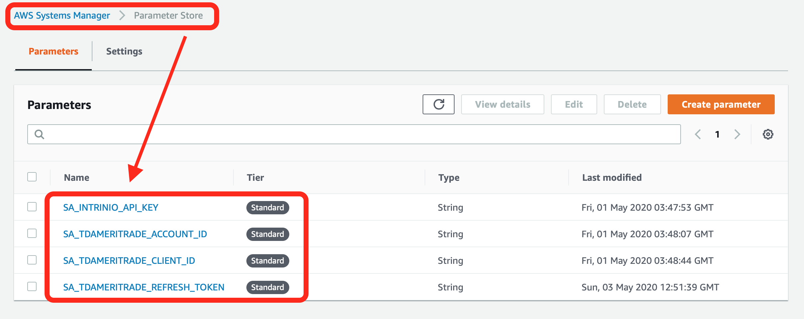
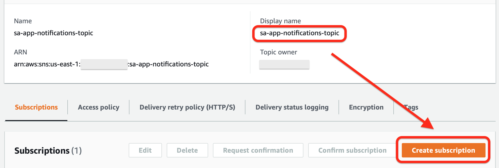

# Stock Advisor Infrastructure
This project contains the scripts necessary to provision the Stock Advisor infrastructure, and deploy the system. The scripts are based on the AWS CDK and are invoked using the standard entry-points.

The system is organized into three different GitHut repos

|Project Name|Project URL|Description|
|---|---|---|
|Stock Advisor Infrastructure|https://github.com/hanegraaff/stock-advisor-infrastructure|Contains automation to deploy infrastructure and CI automation|
|Stock Advisor Software|https://github.com/hanegraaff/stock-advisor-software|Stock Advisor Services. The software that makes up the system|
|TDAmeritrade Authentication|https://github.com/hanegraaff/TDAmeritrade-api-authentication|Contains documentation and a sample application used to demonstrate the TDAmeritrade authorization and authentication process. This repo is not required to build the system, and should be considered supplementary documentation|

# Project status
The project currently is under development, with a working initial version of it complete.

 # Overview


Stock Advisor is an algorithmic trading system that can trade on your behalf using your brokerage account. It selects a live portfolio of US securities based on market sentiment and actively trades it.

The system is written in Python and runs in AWS, using a serverless platform. It relies on an external source for its financial data as well as an existing online brokerage platform to execute trades. Financial data is provided by **Intrinio** (www.intrinio.com), while brokerage services are provided using the **TDAmeritrade** api (https://www.tdameritrade.com/api.page).

Broadly speaking, the system is organized in two services. The first is a recommendation service that predicts a monthly pool of US Equities expected to outperform the market, and the second is a portfolio manager that executes trades and maintains a portfolio based on it.

## Recommendation Service
**Status: Initial Development Complete**

This service makes monthly recommendations of US equities using an algorithm based on market sentiment and stores the results in S3. It runs inside a docker container running as a Fargate task within the ECS cluster, and will generate new predictions at beginning of each month once all analyst target price predictions for the previous month have been made available. It runs daily at 6AM EST, but will only generate a new recommendation when the existing one expires.

The input is a list of ticker symbols that represents the universe of stocks that will be analyzed. This list can contain any US Stocks and currently uses the DOW30. Eventually it will be replaced with the S&P500, or other larger indexes. 

The service requires access to financial data, specifically pricing information and analyst forecasts, which is downloaded and cached in order to reduce reliance in the Data APIs

## Portfolio Manager
**Status: Initial Development Complete**

The portfolio manager selects a portfolio based on the current recommendations, and is responsible for executing the underlining trades necessary to materialize it. Each time it runs, it loads and compares the current portfolio and latest recommendations and decides whether any rebalancing is required. Before exiting, the portfolio manager will publish a SNS notification containing a summary of the current portfolio and its returns.

Like the Recommendation service, the portfolio manager runs as a Fargate task and is scheduled to run daily, at 11AM EST.

# Stock Advisor AWS Infrastructure
**Status: Initial Development Complete**

Stock Advisor's infrastructure is defined using a CDK based script, which exposes three stacks:

```
>>cdk ls
app-infra-base
app-infra-compute
app-infra-develop
```

Information on getting started with the CDK is available here:

https://docs.aws.amazon.com/cdk/latest/guide/getting_started.html

## Configuration

```app.py``` contains configuration that can be used to customize the application infrastructure. As of this version it is possible to change the following configuration:

* **Application Namespace:** A namespace used as a prefix for the AWS resources created by this automation. It it currently set to ```sa```, and it's used to facilitate the creation of multiple instances of this application.

* **Application Github Repo:** The details of the Github application repo containing the application code.

The namespace is defined inside ```app.py``` and is currently set to ```sa```

```
props = {
  'APPLICATION_PREFIX': 'sa',
  'GITHUB_REPO_OWNER': 'hanegraaff',
  'GITHUB_REPO_NAME': 'stock-advisor-software'
}
```


## app-infra-base stack


This stack creates the foundational resources which don't change often, and include:

1) A Public VPC spanning two subnets (no NAT)
2) S3 buckets to store application data and artifacts
3) ECS cluster compatible with Fargate.
5) SNS Topic used for application notifications
6) A security group used by the ECS tasks.
7) IAM task role that define the AWS permissions allowed by the ECS tasks.

### Exports
|Export Name|Description|
|---|---|
|{app_ns}-data-bucket-name|S3 Data Bucket used by the application|
|{app_ns}-app-notifications-topic|SNS Topic for application notifications|

Additionally, there are automatically generated exports which are not documented here. These are used by the CDK to manage dependencies between stacks


## app-infra-compute stack

This stack creates the application compute resources that are more prone to change and include:

1) ECR repository for the Recommendation Service Image
2) ECR repository for the Portfolio Manager
3) ECS Task and Scheduled Task definitions
4) ECS Execution IAM role. The role is maintained here since each new task definition will inject an additional policy into it.
5) Application parameters stored in Parameter Store
    
## app-infra-develop stack


Contains the application CICD's resources, namely the CodeBuild project used to build the two services listed above

# Provisioning the infrastructure

## Prerequisites
1) Latest AWS CDK
2) Latest Python 3.x
3) An AWS account where resources can be deployed
4) AWS Credentials configured in a way that can be read by the Boto (Python SDK) library.

## Create a virtual environment
```
$ python3 -m venv .env
```

After the init process completes and the virtualenv is created, you can use the following step to activate your virtualenv.

```
$ source .env/bin/activate
```

If you are a Windows platform, you would activate the virtualenv like this:

```
% .env\Scripts\activate.bat
```

## Installing Dependencies
Once the virtualenv is activated, you can install the required dependencies.

```
$ pip install -r requirements.txt
```

To include additional dependencies, for example other CDK libraries, just add to
your requirements.txt file and rerun the `pip install -r requirements.txt`
command. Alternatively you may add those to ```setup.py```


## Creating/Destrying the application infrastructure

To create or update the application infrastructure you may rely on the ```cdk deploy``` command

```
cdk deploy app-infra-base
cdk deploy app-infra-compute
cdk deploy app-infra-develop
```

To destroy it, use the ```cd destroy``` command

```
cdk destroy app-infra-base
cdk destroy app-infra-compute
cdk destroy app-infra-develop
```

To create the application infrastructure in a single command use:

```
cdk deploy app-infra-base app-infra-compute app-infra-develop
```

The infrastructure can be destroyed using a similar command line

```
cdk destroy app-infra-base app-infra-compute app-infra-develop
```

## Testing
CDK doesn't currently offer testing framework for Python, but a basic testing script can be executing using```pytest```.

Unit tests will be added a soon as CDK offers it.


## Useful commands

 * `cdk ls`          list all stacks in the app
 * `cdk synth`       emits the synthesized CloudFormation template
 * `cdk deploy`      deploy this stack to your default AWS account/region
 * `cdk diff`        compare deployed stack with current state
 * `cdk docs`        open CDK documentation


# Building and deploying the application software
Once you have successfully deployed the infrastructure, you may now build and deploy the application software, namely the docker images that represent the services described above.

## Setting up the API and Authentication keys
All application secrets are stored in the Parameter Store. When the infrastructure is initially provisioned, these parameters will be created and populated with default (non-working) values.



## Setting the Intrinio API key
First navigate to the parameter store and find the stack's and find the appropriate ```INTRINIO_API_KEY```, prefixed with the value of ```APPLICATION_PREFIX```


Next replace the default value ```put_api_key_here``` with a valid key. You may sign up for a sandbox or production key by visiting the Intrinio website.

## Setting up the TDAmeritrade authentication keys
Repeat the same process for the for the TDAmeritrade Keys. For details on how to accomplish that, see the instructions outlined in this repo:

https://github.com/hanegraaff/TDAmeritrade-api-authentication


## Setting up Notifications

Application events are published to a SNS topic which is created by the app-infra-base stack. You may set up an email or SMS Notification manually using the AWS console. The system will generate notifications for the following events:

1) Monthly, when a new recommendation is created
2) Daily, to summarize the portfolio current returns and performance.
3) Whenever an error prevented any of the services from running

## Running the CodeBuild jobs
The ```app-infra-develop``` stack exposes 2 CodeBuild project that can be used to build the Stock Advisor services


To build the services, simply start the build process, no customizations are needed. Note that these projects are configured to build from the project ```master``` branch. If you want build using a different branch, you may do so by overriding the appropriate ```source``` parameter.


Once the build have been completed, they will be deployed to their respective ECR repos, and are ready to be used.

# OK, what now?
Once the infrastructure is provisoned and the application software is deployed to ECR, the system is ready to use. Fargate tasks will start running automatically and will start the recommendation and trading process.

As of this version the primary way to interact with the system is the AWS console. Future version of this software will include a UI that will provide better controls.

## Application Logs


All logs are stored in CloudWatch. Both application and CodeBuild logs are stored here.

|Log Group|Description|
|---|---|
|/aws/codebuild/{app_ns}-portfolio-manager-project|Codebuild (CI) logs for the portfolio manager service
|/aws/codebuild/{app_ns}-recommendation-service-project|Codebuild (CI) logs for the recommendation service
|{app_ns}/ecs/recommendation-service|Recommendation Service Application logs|
|{app_ns}/ecs/portfolio-manager|Portfolio Manager Application logs|

## Scheduled Tasks


Scheduled task can be found by navigating to the ECS main page and selecting the application ECS cluster that was created by this automation. Here you can see when the tasks are schedule to run. You may also run the tasks on demand by navigating to the ```Task Definitions``` page.

## Running the tasks on demand


When running the task be sure to set the following:

1) Set the launch type to ```Fargate```.
2) Select the VPC that was created using the automation. The CIDR block is 192.16.0.0/16, or you can check the tags to identify the proper one.
3) Select a security group with 'no inbound/full outbound' access. This automation creates one called ```sa-sg```.
4) Ensure the that a public IP address is auto assigned.


